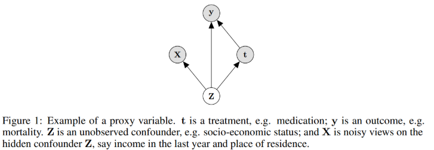

# Introduction {#intro}

## Abstract

- Build on recent advances in latent variable modeling to simultaneously estimate the unknown latent space summarizing the confounders and the causal effect
- Based on VAE, with proxies

## Old study:

give methods which are guaranteed to recover the true causal effect when proxies are observed. However, the strong guarantees these methods enjoy rely on strong assumptions. In particular, it is assumed that the hidden confounder is either categorical with known number of categories, or that the model is linear-Gaussian.

=> In practice, we cannot know the exact nature of the hidden confounder Z

## Propose

Approach tailored to the surrogate-rich setting when many proxies are available: Estimation of a latent-variable model where we simultaneously:

- discover the hidden confounders ( <= old study put assumption on this, now we remove it)
- infer how they affect treatment and outcome

In this graph, Observation are gray, hidden confounder is white. I drew it in reverse color at all graphs below.

Method: based on VAE
Disadvantage: little theory is currently available to justify when learning with VAEs can identify the true model => Which mean we pretty much don't know if it is learning correctly.
Advantage: they make substantially weaker assumptions about the data generating process and the structure of the hidden confounders  
