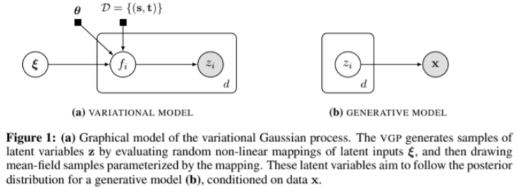
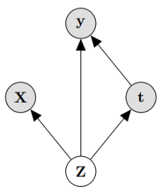
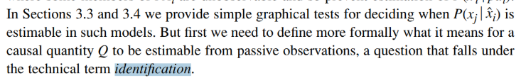
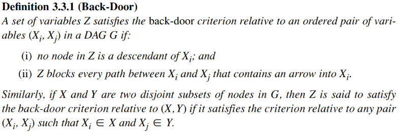
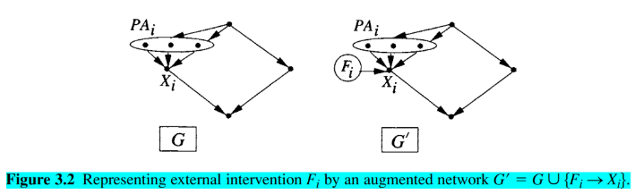

# Identification of causal effect {#indentify}

Question from the title:

- what is the purpose of this part?
- What does Identification mean?

Assume:

- Treatment t is binary, for simplicity and compatibility with prior benchmarks (in IHDP and Jobs benchmark, treatment is yes or no). However proposed model does not limit by this (We don't have benchmark for this so I don't know if it is true)
- joint distribution p (Z, X, t, y) of the latent confounders Z and the observed confounders X can be approximately recovered solely from the observations (X, t, y)

With 2nd assumption, we can't compute if X has nothing to do with Z. But there are many cases we can. Authors said they show some example in Chapter \@ref(intro). But in the introduction, we only saw example X is proxy or noise of Z. Besides, authors also list 3 cases:

- if X includes three independent views of Z
- if Z is categorical and X is a Gaussian mixture model with components determined by X
- if Z is comprised of binary variables and X are so-called “noisy-or” functions of Z

Take the last case, Z is the input of X, so X also directly relate to Z. We could conclude that the idea is if Z->X then we can compute it.

In the paper, the authors also talk about VAE could recover many  Latent Variable Model, I have read the reference paper, in that paper it's called Variational Gaussian process (VGP) with similar idea to VAE (encode input -> z and then decode z -> output)
VGP can recover discrete mixture of mean-field distributions and recover a form of factor analysis. (I don't know any of these at this point)

Caveat: optimization process is not guaranteed to achieve the true minimum even if it is within the capacity of the model, similar to the case of classic universal approximation (UA) results for neural networks.

Reading caveat remind us that the reason could be from using NN.

## Identifying individual treatment effect

We care about finding ITE (another name is CATE) and ATE

$$I T E(x):=\mathbb{E}[\mathbf{y} | \mathbf{X}=x, d o(\mathbf{t}=1)]-\mathbb{E}[\mathbf{y} | \mathbf{X}=x, d o(\mathbf{t}=0)]$$
$$A T E:=\mathbb{E}[I T E(x)]$$

Identification in our case is result of Pearl’s back-door adjustment.
Theorem 1. If we recover p (Z; X; t; y) then we recover the ITE under the causal model in Figure 1.

Proof. We will prove that $p(\mathbf{y} | \mathbf{X}, d o(\mathbf{t}=1))$ is identifiable under the premise of the theorem. The case for $t=0$ is identical, and the expectations in the definition of ITE above readily recovered from the probability function. ATE is identified if ITE is identified. We have that:
$$
p(\mathbf{y} | \mathbf{X}, d o(\mathbf{t}=1))=\int_{\mathbf{Z}} p(\mathbf{y} | \mathbf{X}, d o(\mathbf{t}=1), \mathbf{Z}) p(\mathbf{Z} | \mathbf{X}, d o(\mathbf{t}=1)) d \mathbf{Z} \stackrel{(i)}{=}
$$
$$
\int_{\mathbf{Z}} p(\mathbf{y} | \mathbf{X}, \mathbf{t}=1, \mathbf{Z}) p(\mathbf{Z} | \mathbf{X}) d \mathbf{Z} \ \ \ \ \ (1)
$$
where equality (i) is by the rules of do-calculus applied to the causal graph in Figure $[1] .$ This completes the proof since the quantities in the final expression of Eq. (1) can be identified from the distribution $p(\mathbf{Z}, \mathbf{X}, \mathbf{t}, \mathbf{y})$ which we know by the Theorem's premise.

There are 2 small note:

- Note that the proof and the resulting estimator in Eq. (1) would be identical whether there is or there is not an edge from X to t. This is because we intervene on t
- $\text { y is independent of } \mathbf{X} \text { given } \mathbf{Z}, \text { and we obtain: } p(\mathbf{y} | \mathbf{X}, d o(\mathbf{t}=1))=\int_{\mathbf{Z}} p(\mathbf{y} | \mathbf{t}=1, \mathbf{Z}) p(\mathbf{Z} | \mathbf{X}) d \mathbf{Z}$

***Questions***:

- What does Identification mean?

> In proof, the authors use it as a way to say we can compute it, or identifiable. But using in noun form is weird to me. In Pearl's Causality page 76, the noun form of it represent a kind of question where answer if arbitrary operation Q is computable.

- What is Pearl's back-door adjustment?

> **Theorem 3.3.2 (Back-Door Adjustment) (page 79 Causality)**
If a set of variables Z satisfies the back-door criterion relative to (X, Y), then the causal effect of X on Y is identifiable and is given by the formula  
> $$P(y | \hat{x})=\sum_{z} P(y | x, z) P(z)$$

- Is the sum equal to P(y|x)?

> No, except where z is independ to x. Because $P(y|x) = \sum P(y|x,z)P(z|x)$

- What is the hat?

> it is another notation for do(x)

- What is back-door criterion?

> We called it back-door because every arrow go to $X_i$ ( sentence (ii) in the definition). Pearl show (with proof) that X->Y has do(X) equal to cond(X) when Z blocks all the back-door, which mean y|do(x) have the same result as y|x)
> The idea of the proof is create another variable call $F_i$, for example:

> At this time, all back-door is blocked (if cond() on the small note in the top) then every path from $F_i \rightarrow Y$ (Y is the rightest node) have to fo through $X_i$'s children. If we cond(Xi), $F_i$ is independ to Y. Thus do(x) = cond(x)

- Why can we consider do() as a variable like that?

> I guess because when we use do(), we want to put an action on it, which mean there is a relationship. We can conceptualize this action. The detail of definition for $F_i$ readers can read in Causality, page 71.

*In short, when we say we use back-door adjustment, the idea is we want to convert do() into normal cond().*

***At this moment, we can safely say that the intent of the authors in this part is to say that their model could be compute and infer causal inference (through do-calculus)***
