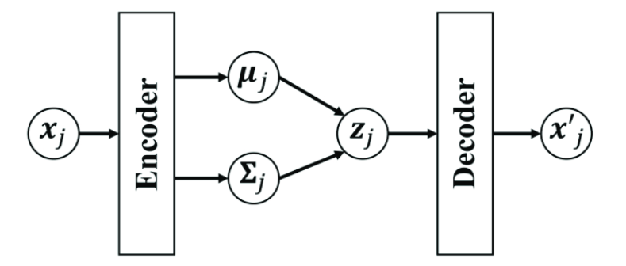
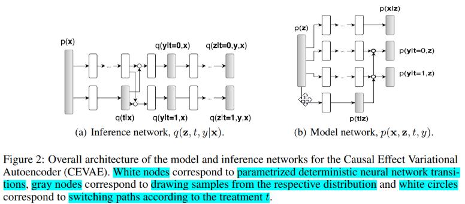
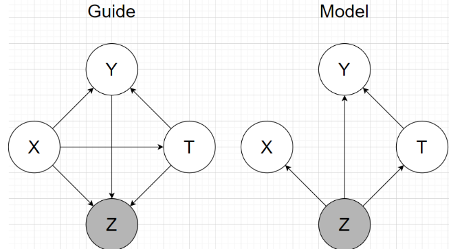
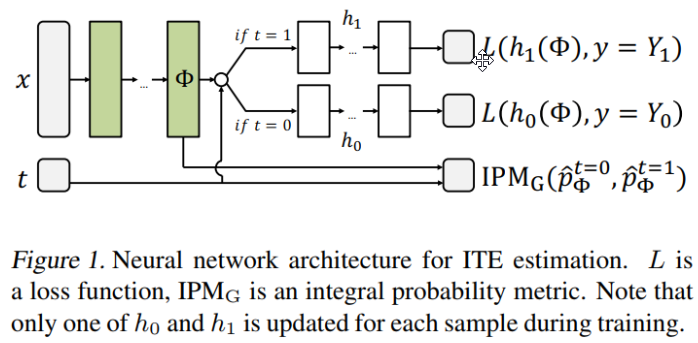
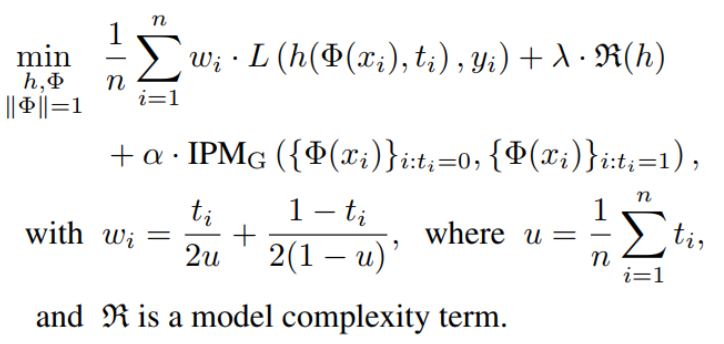
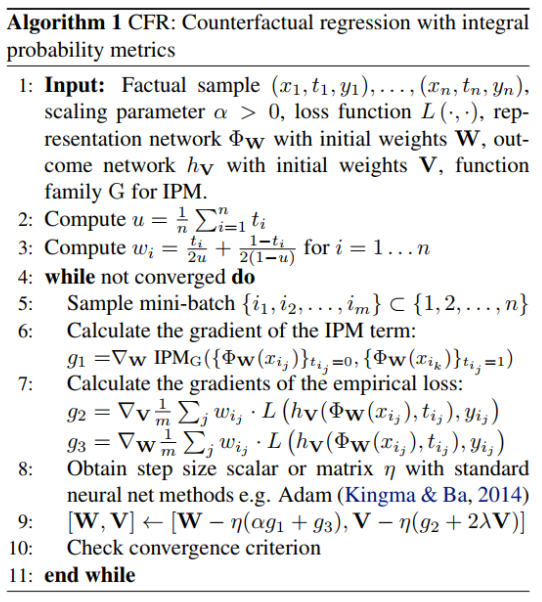
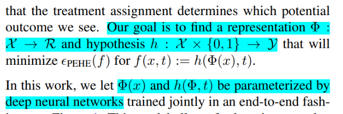
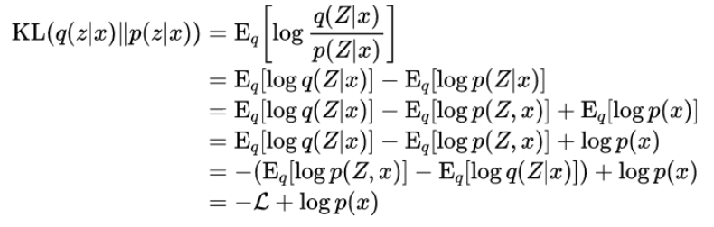
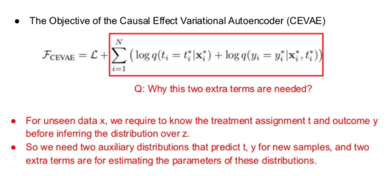

# Causal effect variational autoencoder {#CEVAE}

Question from the title:

- Why use VAE?
- Why use the propose architecture?
- Why use that constant and this prior?
- What is the loss, how define, what is the term, why is that?
  
Let's remind ourself about VAE:

- Why use VAE?

> The authors didn't explain much. I guess they want to use the similar idea of finding hidden variable. And it's more resonable when VAE (VCG) can recover many model.

The architectures:

Note: no matter how, Y is influenced by T.

Then the authors:

- Assume that obs factorize conditioned on latent variable
- Using inference network follow a factorization of *the true posterior*
- Using generative network architecture inspired by TARnet, but instead of conditioning on observations we condition on the latent variables z

- True posterior ?

> It took me a while to understand. The idea is using chain rule
> $$Q(z,y,t|x) = Q(z|x,t,y)Q(y|x,t)Q(t|x)$$

- Why we choose those term?

> In the case $Q(z,y,t|x)$, maybe it is the consequence of choosing the architecture of model, which is inspired by TARNet, z impact on x,y,t so now to compute posterior we have to condition on those. Moreover, I can see that the authors want to use all data they got to find z. Other terms are unclear to me.

- What is "instead of conditioning on observations we condition on the latent variables z" ?

> The authors trying to different the original model TARNet, in the original they only condition on x to compute y, now we use z instead (paragraph 2 part 4 paper [@shalit2016estimating])
$$\begin{aligned}
&y_{i} \sim p\left(Y_{1} | x_{i}\right) \text { if } t_{i}=1\\
&y_{i} \sim p\left(Y_{0} | x_{i}\right) \text { if } t_{i}=0
\end{aligned}$$

- What is TARNet?

> TARNet is a network using neural network to capture relationship, a feed forward network.
> 
> Integral Probability Metric (IPM) measure of distance between two distributions p(x|t = 0), and p(x|t = 1)
Objective:

> $\alpha > 0$ then called CFR, $alpha= 0$ is TARNet (remove the IPM term)
Algorithm to learn CFR (remove IPM is TARnet).
> 
> 

- Why do we use nn in eevry place?

> The authors probably want using the flexible of nn to capture relationships.

The define prior and density part are pretty detail, readers can read in the paper. But there are question as well.

- What is switching mean?

> It is basically the ta + (t-1)b part, meaning switch between a or b base on t status.

- Why use $N(0,1)$ as prior to z? Can we change it?

> Yes, we can change, readers will see that in toy benchmark later. It is just a way to define z.

- Why we need two $g()$ in guide, when only need 1 $f()$ in model?

> In guide we want to use x,y to learn about z. X consist of all kind of distribution, e.g categorical, normal, binomial ..., that's why we need an neural network to learn the representation space first, then apply encode network. In model our z is just one distribution, so no need of second network.

- Why does the lower bound have formula like that?

> 
> Note: $log p(x)$ independ to q, so we consider it is a constant. If we see x as the tuple x,y,t then the $\mathcal{L}$ becomes the lower bound we saw in the paper.

- What does auxiliary distributions mean?

> 
> We know that VAE only encode X to z, then z decode to output. In our case, our guide need addition y,t to compute z. That's why the authors said we need to predict those two.
