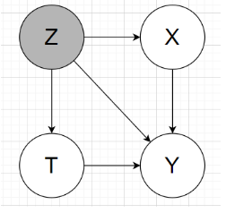
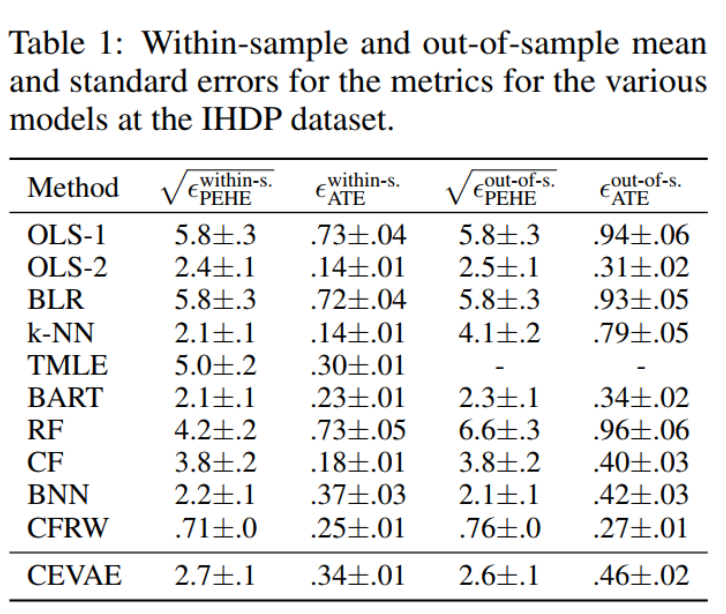
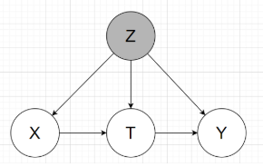
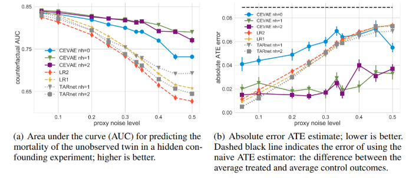

# Experiments {#exp}

## Benchmark dataset

There are 2 benchmark people usually use is Infant Health and Development Program (IHDP) and Jobs. The authors use those so there is no need to construct proxies. But to show the power of learning proxies, the authors proposed 2 other benchmarks is synthesis data and Twins.

### IHDP

Context:

- Treatment group will be provide special care and home visits from a trained provider. In the original study, the final cognitive test scores (CTS) is higher when they are treated.
- We care about the effect of *home visits by specialists* on *future cognitive test scores*
- If t=1, child get treatment, t=0 is not.

Description:

- IHDP consists of 6 continuous 19 binary covariates.
- Outcome is simulated
- Treatment and control group is unbalanced, 139 is treated, 608 in control.
- Outcome using in this paper is from Setting A from <https://github.com/vdorie/npci> (is the Setting B in [@doi:10.1198/jcgs.2010.08162]). Produce 1000 replications.
- Split train/val/test set with the same ratio as [@shalit2016estimating] for each replications.
- For each replication, the networks will be retrain and compute error and final results will be averaged.
- Outcome Y is simulated, distribution is Normal, nonlinear and not parallel across treatment conditions. Y is depend on X to satisfy ignorability.

In my understanding, the graphical model will look like:

2 main tasks: estimating the individual / population causal effects

- Individual treatment effect is Precision in Estimation of Heterogeneous Effect (PEHE) (reflects the ability to capture individual variation in treatment effects).
  
  PEHE $=\frac{1}{N} \sum_{i=1}^{N}\left(\left(y_{i 1}-y_{i 0}\right)-\left(\hat{y}_{i 1}-\hat{y}_{i 0}\right)\right)^{2},$ where $y_{1}, y_{0}$ correspond to the true outcomes under $t=1$ and $t=0,$ respectively, and $\hat{y}_{1}, \hat{y}_{0}$ correspond to the outcomes estimated by our model.
- population causal effect: absolute error on the Average Treatment Effect (ATE)
  
  $\epsilon_{\mathrm{ATE}}=| \frac{1}{n} \sum_{i=1}^{n}\left(f\left(x_{i}, 1\right)-f\left(x_{i}, 0\right)\right)-\frac{1}{n} \sum_{i=1}^{n}\left(m_{1}\left(x_{i}\right)-\right.\left.m_{0}\left(x_{i}\right)\right) | .$

  with $m_{1}(x)=\mathbb{E}\left[Y_{1} | x\right], m_{0}(x)=\mathbb{E}\left[Y_{0} | x\right]$

Those above metrics the smaller the better

### Jobs:

Pretty much the same as IHDP benchmark, except this is the real outcome from real life, not simulated.

Evaluation:

- Use policy risk to replace ITE because we don't know the other treatment. Thus, we don't have groundtruth for ITE
- Population CE: use absolute error on the Average Treatment effect on the Treated (ATT) for the exact same reason.

The authors didn't public this dataset.

### Synthesis toy data:

Read paper for this part, it's not much content.

### Binary treatment outcome on Twins

Context:

- Data from twin births in the USA between 1989-1991, only chose twins which are the same sex, focused on twins such that both were born weighing less than 2kg
- The treatment t = 1 is being born the heavier twin
- The outcome corresponds to the mortality of each of the twins in their first year of life => could be considered as the two potential outcomes for each treatment

=> We want to know the effect of being born heavier on the mortality in first year.

Description:

- Dataset of 11984 pairs of twins, for each twin pair we observed both the case t = 0 (lighter twin) and t = 1 (heavier twin)
- 46 covariates: mother and father education, marital status, race and residence; number of previous births; pregnancy risk factors such as diabetes, renal disease, smoking and alcohol use; quality of care during pregnancy; whether the birth was at a hospital, clinic or home; and number of gestation weeks prior to birth.  
- More detail about each covariate is in my read data Twins notebook
- Missing value xử lý: For the features that had more than 20% missing values we assigned to the missing values a constant number that was the maximum of the existing values + 1. Essentially this creates a separate 'nan category' for those features. For the rest we used a most-frequent imputation strategy.

Simulate 2 kind of trial:

- Observational study: selectively hide one of the two twins  
- Randomized trial: randomly hide one

To simulate hidden confounding with proxies:

- Condition the treatment variable under highly correlated variable with outcome, the authors chose GESTAT10 (the define in paper is unclear to me why they choose w0,w1 that way, and the GESTAT10 itself is complicated too)
- To create proxies, the authors encode G10 1hot, replicate 3 times (unclear these are in the same data or split to retrain like IHDP). The reason authors choose 3 replicate because the references in the paper show that only 3 replicate is enough the recover the origin encoded variable.
- With each bit in 30bits above, randomly and independently flipped with prob varies from 0.05 to 0.5, latter indicating there is no direct information about the confounder.

Note: In the public data, the authors give the raw data, haven't encode G10 into 1hot. I assume 3 replicate is in the same data. I need to read more into reference papers to understand which one is correct.

The graphical model will be like:

Groundtruth: mortality rate for the lighter twin (t=0) is 18.9%, and for the heavier (t=1) 16.4%, for an average treatment effect (ATE) of -2.5%

2 tasks inferring:

- the mortality of the unobserved twin (counterfactual): Predict alive or death, then get accuracy, then draw AUC as below pictures
- $\epsilon_{A T E}=|A \hat{T} E-A T E |$, with $A \hat{T} E$ is the ratio of outcome t=1 and t=0 substract eachother. (ratio of alive cases)

In comparision to other methods, in Figure (a), the higher the better, and (b) the lower the better.

